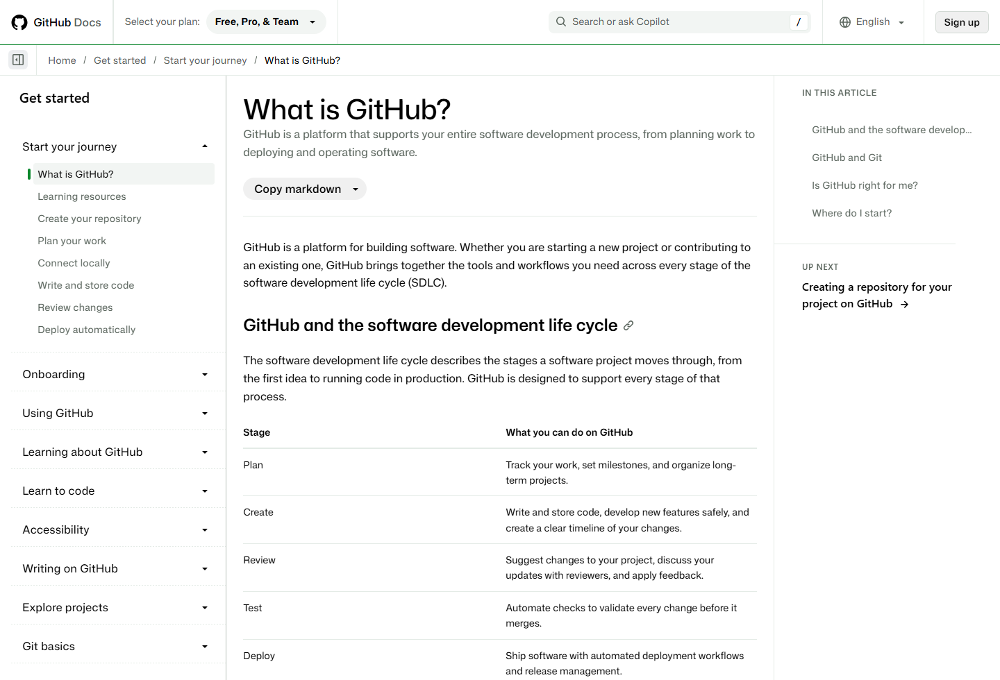
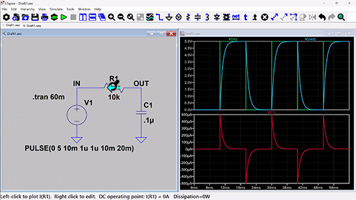
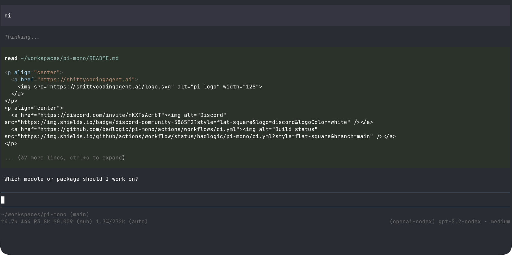

# 微电子学习工具笔记

整理日期：2026-09-22。

按课程和项目任务整理开发、仿真、资料管理与AI工具。
各节包含用途、基本操作、配图和参考入口。
课程指定的软件版本、器件库和提交格式以教学要求为准。

## 1. 课程与工具对应

| 学习任务 | 常用工具 | 典型文件或输出 |
|---|---|---|
| C/C++与Python编程 | VS Code、CLion、PyCharm | 源码、构建配置、测试 |
| 模拟电路 | LTspice、Multisim | 原理图、网表、波形 |
| 原理图与PCB设计 | 嘉立创EDA、Altium Designer、KiCad | 原理图、PCB、BOM、Gerber |
| 单片机与嵌入式 | STM32CubeIDE、Keil、ESP-IDF | 固件、调试日志、串口数据 |
| 数字逻辑与FPGA | Quartus、Vivado、ModelSim／Questa | HDL、testbench、波形、时序报告 |
| 信号处理与数据分析 | MATLAB、Python、Jupyter | 数据、脚本、图表 |
| 报告与文献阅读 | Word、LaTeX、Zotero | 报告、参考文献、批注 |
| 笔记与任务管理 | Notion、Obsidian、日历工具 | 学习笔记、资料索引、任务表 |
| 版本管理与协作 | Git、GitHub | 提交记录、分支、Issue |

其中，编辑器、Git、Python和笔记工具可跨课程复用。
电路、FPGA和MCU软件通常随具体课程或开发板配置。
芯片设计、TCAD和多物理场工具见第4.4节。

## 2. Git与GitHub

### 2.1 工具与平台

| 名称 | 作用 |
|---|---|
| Git | 本地版本控制，记录文件修改及版本关系 |
| GitHub | 托管Git仓库，提供Issue、代码审查等协作功能 |
| GitHub Desktop | Git的图形客户端 |
| GitHub Pages | 托管静态网站，可用于项目主页和技术博客 |
| Gitee | 另一种代码托管平台 |



图1．GitHub官方入门文档。左侧为学习目录，
正文介绍仓库、协作及开发流程。
来源：[GitHub Docs](https://docs.github.com/en/get-started/start-your-journey/what-is-github)。

### 2.2 基本操作

| 操作 | 命令 | 用途 |
|---|---|---|
| 查看状态 | `git status` | 查看已修改、已暂存和未跟踪文件 |
| 查看修改 | `git diff` | 比较尚未暂存的内容 |
| 查看暂存内容 | `git diff --staged` | 检查下一次提交包含的修改 |
| 查看历史 | `git log --oneline` | 浏览提交记录 |
| 克隆仓库 | `git clone <url>` | 获取远端仓库及历史 |
| 暂存文件 | `git add <file>` | 选择本次提交的文件 |
| 创建提交 | `git commit -m "说明"` | 保存一个本地版本 |

后续学习内容包括分支、合并、冲突处理，
以及`fetch`、`pull`和`push`的区别。
提交前检查修改范围，提交说明写明具体变化。

### 2.3 工程中适合保存的内容

- 源代码、构建配置和依赖清单。
- Markdown或LaTeX报告源文件。
- 仿真网表、参数配置和后处理脚本。
- README中的环境、连接方式和运行步骤。
- `.gitignore`中的缓存、临时文件和生成目录规则。

大型仿真结果可单独归档，在仓库中记录来源与路径。
PCB二进制工程可配合PDF原理图、BOM和制造输出审查。
密码、API Key、授权文件及受限PDK不提交到仓库；
重要原始数据另行备份。

## 3. 编辑器、IDE与嵌入式开发

### 3.1 编辑器与IDE

IDE通常集成工程管理、构建和调试功能。
编译器、SDK和调试探针是工具链中的其他组件。
VS Code是编辑器，相关开发能力主要通过扩展提供。

| 工具 | 主要用途 | 配置内容 |
|---|---|---|
| VS Code | Python、C/C++、Markdown、远程开发 | 语言扩展、解释器、构建和调试配置 |
| PyCharm | Python工程开发 | 解释器、虚拟环境、测试与调试 |
| CLion | C/C++、CMake与嵌入式工程 | 编译器、CMake、调试器和工具链 |
| STM32CubeIDE | STM32开发与调试 | 目标芯片、工程配置、下载与调试接口 |
| Keil µVision | 课程指定的ARM或8051工程 | 器件包、编译器和调试探针 |
| ESP-IDF | ESP32系列SDK与开发工具链 | 芯片型号、SDK版本、构建和烧录参数 |
| Arduino IDE | 开发板程序和传感器验证 | 板卡支持包、库与串口 |
| PlatformIO | 多种开发板的工程管理 | 平台、框架、库和构建环境 |


图2．VS Code官方界面配图。
A为活动栏，B为主侧栏，C为编辑区，
D为面板，E为状态栏；终端和调试输出位于面板中。
来源：[VS Code文档](https://code.visualstudio.com/docs/editing/getting-started/userinterface)。

### 3.2 嵌入式工具链

以STM32的C/C++工程为例：

| 组件 | 示例 | 作用 |
|---|---|---|
| 交叉编译器 | Arm GNU Toolchain | 将源码编译为目标芯片指令 |
| 构建系统 | CMake、Make、Ninja | 管理文件依赖与构建过程 |
| 调试器 | GDB | 断点、单步、变量、寄存器与调用栈 |
| 调试服务 | OpenOCD、J-Link GDB Server | 连接调试器与硬件探针 |
| 硬件探针 | ST-LINK、J-Link | 通过SWD/JTAG等接口访问芯片 |
| 串口工具 | VOFA+等 | 接收日志、查看数据和绘制波形 |

CLion可以组织CMake工程，并配置嵌入式调试链。
STM32CubeIDE则提供集成度较高的厂商开发环境。
初次调试可练习：在`main`处暂停、查看变量、
单步执行、检查调用栈和读取外设寄存器。

STM32与ESP32需要各自匹配的工具链。
ESP32系列包含Xtensa和RISC-V型号，
不能统一使用ARM Cortex-M配置。

## 4. 电路与电子设计

### 4.1 电路仿真

| 工具 | 主要用途 | 适用内容 |
|---|---|---|
| LTspice | SPICE电路与器件分析 | 模拟电路、电源、滤波器 |
| Multisim | 图形化电路实验与虚拟仪器 | 课程电路实验 |
| ngspice | 开源SPICE仿真 | 网表、脚本集成和自动化 |
| Proteus | 受支持器件的单片机与电路联合仿真 | 按具体芯片和课程需求使用 |



图3．LTspice官方RC电路示例。
左侧为原理图，右侧为电压与电流波形。
来源：[Analog Devices](https://www.analog.com/en/resources/design-tools-and-calculators/ltspice-simulator.html)。
原配图为512×288像素，适合查看布局和分析类型。

基本分析类型：

| 分析 | 观察内容 | 常见问题 |
|---|---|---|
| 工作点 | 静态电压、电流和器件状态 | 偏置是否合理，器件是否进入饱和区 |
| 瞬态 | 信号随时间的变化 | 启动、充放电、过冲、振荡 |
| 交流小信号 | 增益和相位随频率的变化 | 截止频率、带宽、相位特性 |
| 参数扫描 | 参数变化对结果的影响 | 电阻、电容、负载或供电变化 |

仿真前记录器件模型、激励和参数；
分析后核对单位、工作范围和基本理论值。
器件饱和、寄生参数及温度可能造成理想模型与实物的差异。

### 4.2 原理图与PCB

| 工具 | 适用场景 | 主要学习内容 |
|---|---|---|
| 嘉立创EDA | 国内元件库与打样流程 | 原理图、封装、布线、制造检查 |
| Altium Designer | 课程、团队及复杂PCB工程 | 库管理、设计规则与协作 |
| KiCad | 开源跨平台PCB设计 | 原理图、PCB布局与制造输出 |


图4．嘉立创EDA专业版官网截图，
展示PCB设计界面及在线、客户端入口。
来源：[嘉立创EDA](https://pro.lceda.cn/)。

典型操作顺序：

1. 绘制原理图，核对器件型号和引脚。
2. 分配封装，检查焊盘、尺寸和方向。
3. 设置板框、层叠及设计规则。
4. 布局、布线，检查供电、回流路径和去耦。
5. 执行ERC/DRC，人工复核接口和器件额定值。
6. 导出Gerber、钻孔、BOM及所需装配文件。

ERC/DRC检查规则冲突；
器件选择、电平兼容和电路功能仍需单独核对。

### 4.3 FPGA与HDL仿真

| 工具 | 任务 | 配置依据 |
|---|---|---|
| Quartus | Altera/Intel FPGA综合、布局布线与下载 | 板卡、器件系列和课程版本 |
| Vivado | AMD/Xilinx相关FPGA开发 | 目标器件的支持情况 |
| ModelSim／Questa | HDL功能仿真与调试 | 语言、库及测试平台 |
| Icarus Verilog／Verilator＋GTKWave | 开源HDL仿真与波形查看 | 语言、时序和器件模型支持范围 |

学习内容包括组合逻辑、时序逻辑、
Verilog/SystemVerilog、testbench、
时钟与复位、时序约束和上板验证。
功能仿真、综合、静态时序分析分别检查不同问题。

### 4.4 芯片、器件与多物理场工具

| 方向 | 常见工具 | 相关基础 |
|---|---|---|
| 模拟集成电路 | Cadence Virtuoso、Spectre、HSPICE | 模电、MOS器件、小信号分析 |
| 数字IC与验证 | HDL仿真、综合、静态时序和物理设计工具 | 数字逻辑、HDL、时序 |
| 半导体器件 | Sentaurus TCAD、Silvaco相关工具 | 半导体物理、数值建模 |
| 版图与开源流程 | KLayout、合规可用的开放PDK | 版图规则与工艺 |
| 射频、电磁与封装 | HFSS等 | 电磁场、传输线、边界条件 |
| 结构、热与多物理场 | ANSYS、Abaqus等 | 力学、传热、网格与数值验证 |

这类工具通常在高年级课程或实验室项目中使用。
安装环境、许可证、PDK和器件模型由具体课程或项目确定。
受限工程和工艺资料按授权范围保存和传输。

## 5. 数学计算与数据处理

| 工具 | 用途 | 常见任务 |
|---|---|---|
| MATLAB／Simulink | 矩阵、信号、控制与系统模型 | 信号分析、系统仿真 |
| Python＋NumPy／SciPy | 数值计算与数据处理 | 拟合、滤波、参数计算 |
| Matplotlib | 可重复生成图形 | 波形、频响、实验对比图 |
| pandas | 表格和CSV处理 | 串口记录清洗、批量汇总 |
| Jupyter | 计算与说明结合的笔记 | 公式验证和探索分析 |
| Excel | 表格编辑与快速检查 | 少量数据核对与协作 |

Python项目通常使用独立环境：
已有conda工程沿用其环境配置；
轻量项目可使用`venv`或uv管理。
记录Python版本、依赖和运行命令。
Jupyter交付前从新内核完整执行，检查单元格顺序。

串口CSV处理可按以下步骤练习：

1. 读取时间、电压等字段。
2. 检查单位、缺失值与重复记录。
3. 绘制原始波形。
4. 计算平均值、峰值或所需频域量。
5. 将原始数据、处理脚本与输出图分开保存。

## 6. 笔记、文献与报告

### 6.1 资料管理

| 工具 | 用途 | 常见组织方式 |
|---|---|---|
| Notion | 课程、项目和共享资料 | 页面、数据库、任务表 |
| Obsidian | 本地Markdown知识库 | 文件夹、链接、标签 |
| OneNote | 手写、截图与课堂记录 | 笔记本、分区、页面 |
| Zotero | 文献、PDF批注与引用 | 文献集合、标签、引用库 |
| 日历与任务工具 | 截止日期和任务安排 | Notion Calendar、ClickUp等 |


图5．Obsidian官网截图，包含笔记目录、正文及关联视图。
来源：[Obsidian](https://obsidian.md/)。

一份实验或配置笔记可以包含：
问题、环境版本、操作步骤、原始记录、
结果及参考链接。记录报错时保留原始错误文本。
重要资料定期导出或备份。

### 6.2 报告和图表

| 工具 | 用途 |
|---|---|
| Word／WPS | 常规课程报告和模板文档 |
| LaTeX／Overleaf | 公式密集报告及论文排版 |
| PowerPoint | 课堂汇报、答辩、可编辑示意图 |
| diagrams.net | 框图、流程图和系统关系图 |
| PDF阅读器 | 目录导航、检索、批注和页码引用 |

图表应保留源文件，标注变量、单位、图例与数据来源。
引用文献时区分原论文、二手介绍和产品资料。

### 6.3 文件与终端工具

- 7-Zip：压缩与解压。
- Everything：Windows本地文件检索。
- PowerToys：窗口管理、批量重命名等辅助功能。
- 系统截图工具／Snipaste：报错和电路图标注。
- PowerShell／Git Bash：Windows命令环境。
- Windows Terminal／WezTerm：终端会话界面。
- WSL：Windows上的Linux环境。
- SSH、Xshell／PuTTY：连接服务器或开发板。
- tmux：管理远端终端会话。

终端基础包括路径、文件权限、环境变量、
进程、日志和文件传输。远端任务的生命周期
与本地窗口不同，退出前需确认任务和文件保存状态。

## 7. 技术资料与博客平台

### 7.1 资料检索

| 来源 | 适合查找的内容 | 核对信息 |
|---|---|---|
| 官方文档、数据手册 | API、寄存器、器件规格 | 型号、版本、测试条件 |
| TI、Analog Devices应用资料 | 模拟、电源、信号链、布局 | 电路条件与器件适用范围 |
| ST、Espressif文档 | MCU、外设、SDK | 芯片和SDK版本 |
| GitHub、Discussions | 源码、示例、Issue | 提交、版本、许可证 |
| CSDN、博客园 | 中文配置经验和排错记录 | 系统、工具版本、复现步骤 |
| 知乎 | 概念解释、方向比较和经验 | 原始依据与适用场景 |
| 掘金 | 软件工程、前端及开发工具 | 项目技术栈与版本 |
| Stack Overflow | 具体编程问题 | 最小复现、日志和环境 |
| Electrical Engineering Stack Exchange | 电路与器件问题 | 完整电路、供电和测量条件 |
| Bilibili、YouTube | 操作演示和课程 | 配套资料和软件版本 |
| Hackaday、Adafruit、SparkFun | 项目与动手教程 | 元件、供电和连接方式 |

论文检索可使用Google Scholar、IEEE Xplore
及学校图书馆数据库。arXiv预印本与正式发表版本
可能存在差异，引用时记录具体版本。

### 7.2 发布学习笔记

| 方式 | 平台或工具 | 内容管理 |
|---|---|---|
| 平台博客 | 博客园、CSDN、知乎、掘金 | 通过平台编辑器发布 |
| 静态个人站 | GitHub Pages | 仓库管理站点文件 |
| 静态站生成 | Hugo、Hexo | 将Markdown等源文件构建为网站 |

配置记录写明系统和版本；
电路记录附原理图、参数和测量条件；
代码记录附运行入口和复现步骤。
发布前检查引用许可及资料的公开范围。

## 8. AI辅助学习与编程

### 8.1 工具分类

- **对话助手**：解释概念、分析文本、辅助检索与编程。
- **AI编辑器**：在编辑器中结合工程上下文进行修改。
- **Coding Agent**：读取工程、编辑文件、调用工具和测试。
- **Vibe Coding**：以自然语言描述需求，
  通过生成、运行和反馈迭代程序的开发方式。

这些分类存在交叉；同一产品可能提供多种工作方式。

### 8.2 学习与资料处理

| 工具 | 用途 | 需要核对的内容 |
|---|---|---|
| ChatGPT／Claude／Gemini／DeepSeek等 | 概念解释、代码分析、资料阅读 | 公式、推导、出处及代码结果 |
| NotebookLM | 围绕提供的文档问答和整理 | 回答与引用原文是否一致 |
| Perplexity等 | 检索资料入口 | 原链接是否支持相关结论 |
| Google AI Studio | Gemini提示词、多模态与接口原型 | 输入、模型配置及接口行为 |
| Ollama | 本地模型运行 | 模型、硬件需求及外部组件联网行为 |

### 8.3 AI编辑器与Coding Agent

| 工具 | 主要形态 | 常见任务 |
|---|---|---|
| GitHub Copilot | IDE集成 | 补全、问答与代码辅助 |
| Cursor | AI集成编辑器 | 工程阅读、多文件编辑 |
| Windsurf | AI集成开发环境 | 工程修改与迭代 |
| Antigravity／TRAE | Agent开发环境 | 任务驱动的编程流程 |
| Claude Code | 终端Coding Agent | 代码阅读、修改、构建和测试 |
| OpenAI Codex | 代码任务与Agent工作流 | 实现、测试、代码审查辅助 |
| Pi | 可扩展的终端Agent运行框架 | 连接模型、文件工具和自定义流程 |



图6．Pi官方文档的终端交互示例，裁取工具调用、
回复、输入区和状态栏。图片为文档中的历史版本，
不是本机当前会话。
来源：[Pi软件包文档](https://www.npmjs.com/package/@earendil-works/pi-coding-agent)。

Pi是运行框架，模型与访问方式需另行配置。
使用Agent前明确可修改的目录和可执行的操作，
完成后查看diff、构建输出及测试记录。
扩展、插件和外部工具具有各自的访问能力。

### 8.4 Web原型工具

| 工具 | 常见用途 | 检查内容 |
|---|---|---|
| v0 | 网页界面与前端原型 | 组件、响应式布局、交互 |
| Bolt.new | 浏览器中的应用原型 | 依赖、运行环境、数据连接 |
| Lovable | 自然语言驱动的Web应用 | 认证、权限、数据与部署 |

可用于个人作品集、课程资料页或CSV数据展示。
PCB、电路仿真、固件调试和FPGA实现
仍使用各自的工程工具链。

产品选择可比较：支持的语言和系统、
本地与云端执行方式、权限、模型额度、
团队协作及代码导出。价格和教育权益以官网为准。

### 8.5 编程任务描述示例

```text
任务：读取串口导出的CSV，绘制电压随时间的曲线。

输入：data/example.csv。
字段：time_ms、voltage_v。
输出：figures/voltage.png。

要求：
- 不修改原始数据。
- 检查缺失值、非数值和时间顺序。
- 横轴标注毫秒，纵轴标注伏特。
- 只修改指定脚本。
- 给出运行命令、修改清单和测试结果。
- 未执行的测试单独列出。
- 不安装软件、删除文件或上传数据。
```

嵌入式任务还需给出芯片型号、引脚、电平、
时钟和外设约束。寄存器与器件参数以手册为依据。
课程作业中的AI使用遵循教学要求；
受限资料和凭据不作为提示词附件上传。

## 9. 综合练习：RC滤波与数据记录

### 9.1 参数与理论计算

取电阻10 kΩ、电容100 nF，组成一阶RC低通。
时间常数为`τ = RC = 1 ms`，
截止频率为`fc = 1 / (2πRC) ≈ 159 Hz`。
上述数值是练习的理论计算，不是实测结果。

### 9.2 工具与操作

| 步骤 | 工具 | 操作与输出 |
|---|---|---|
| 理论计算 | 纸笔、Python或MATLAB | 计算时间常数和截止频率 |
| 仿真 | LTspice或Multisim | 工作点、瞬态、交流扫描 |
| 可选实物验证 | 面包板、信号源、示波器 | 比较输入输出波形与频响 |
| 可选数据采集 | 课程开发板、串口工具 | 导出带单位和采样信息的数据 |
| 数据分析 | Python | 读取CSV，绘制与理论的对比图 |
| 工程保存 | Git | 保存配置、脚本和修改记录 |
| 学习记录 | Markdown或Notion | 整理连接图、步骤、来源和结果 |

实物部分核对供电、共地、输入幅值和ADC允许范围，
使用合适的限压限流设置。

### 9.3 练习文件

```text
rc-filter/
├── README.md
├── circuit/       # 仿真工程
├── data/          # 原始记录
├── scripts/       # 处理脚本
├── figures/       # 输出图
└── report.md
```

报告记录元件参数、软件版本、激励条件、
采样设置、计算方法以及理论与测量的差异。

## 10. 官网与文档入口

### 基础开发

- [Git](https://git-scm.com/)
- [GitHub](https://github.com/)
- [GitHub文档](https://docs.github.com/)
- [VS Code](https://code.visualstudio.com/)
- [JetBrains](https://www.jetbrains.com/)
- [Python](https://www.python.org/)
- [uv](https://docs.astral.sh/uv/)
- [MATLAB](https://www.mathworks.com/)

### 电子与嵌入式

- [LTspice](https://www.analog.com/ltspice)
- [NI／Multisim](https://www.ni.com/)
- [嘉立创EDA](https://pro.lceda.cn/)
- [Altium](https://www.altium.com/)
- [KiCad](https://www.kicad.org/)
- [ST开发工具](https://www.st.com/)
- [ESP-IDF文档](https://docs.espressif.com/)
- [Arduino](https://www.arduino.cc/)
- [PlatformIO](https://platformio.org/)
- [AMD自适应计算](https://www.amd.com/)
- [Altera](https://www.altera.com/)

### 笔记与文献

- [Notion](https://www.notion.com/)
- [Obsidian](https://obsidian.md/)
- [Zotero](https://www.zotero.org/)
- [Overleaf](https://www.overleaf.com/)
- [diagrams.net](https://www.diagrams.net/)

### AI辅助与原型

- [ChatGPT](https://chatgpt.com/)
- [Claude](https://claude.ai/)
- [Gemini](https://gemini.google.com/)
- [DeepSeek](https://www.deepseek.com/)
- [NotebookLM](https://notebooklm.google.com/)
- [Google AI Studio](https://aistudio.google.com/)
- [Perplexity](https://www.perplexity.ai/)
- [GitHub Copilot](https://github.com/features/copilot)
- [Cursor](https://cursor.com/)
- [Windsurf](https://windsurf.com/)
- [Antigravity](https://antigravity.google/)
- [TRAE](https://www.trae.ai/)
- [Codex](https://openai.com/codex/)
- [Claude Code](https://claude.com/product/claude-code)
- [Pi](https://pi.dev/)
- [Ollama](https://ollama.com/)
- [v0](https://v0.app/)
- [Bolt](https://bolt.new/)
- [Lovable](https://lovable.dev/)

---

配图取自各产品官网或官方文档，来源列于图注。
网页截图日期为2026-09-22；文档配图版本可能较早。
图片用于界面学习，版权归原权利方所有。
